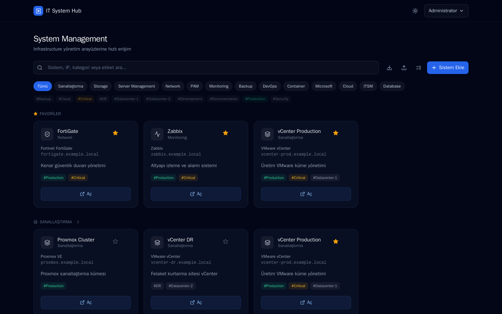
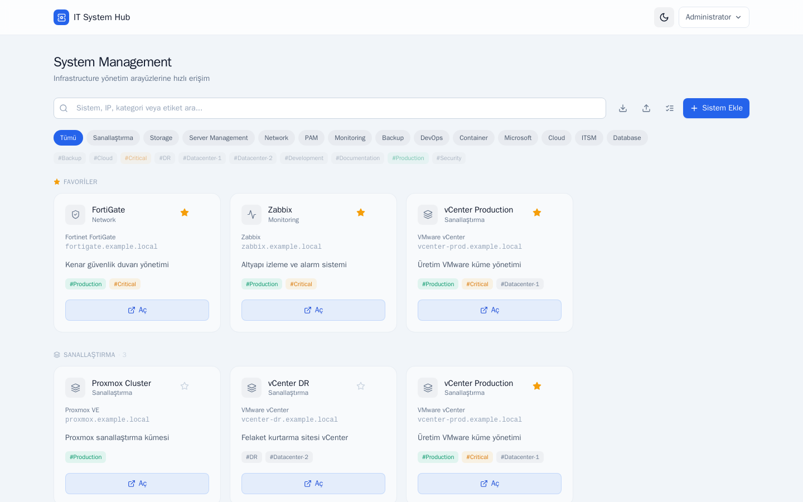
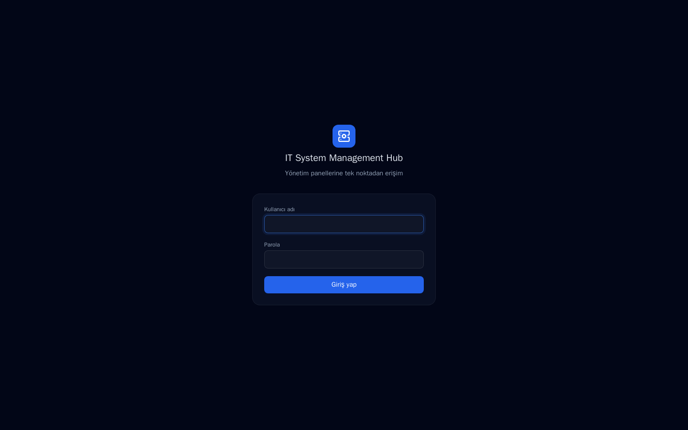
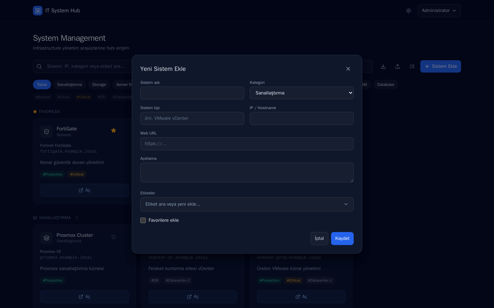
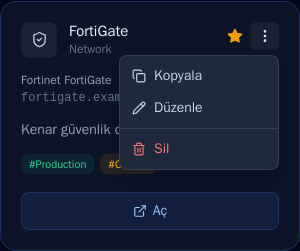

# IT System Management Hub

Sistem uzmanlarının kullandığı tüm yönetim panellerini (VMware, Proxmox, Storage, iLO/iDRAC,
Firewall, Monitoring, Backup, DevOps, PAM, vb.) tek bir ekrandan bulup açabildiği, sade ve hızlı bir
**infrastructure launchpad**.

Uygulama yönetilen sistemleri kendisi yönetmez; sadece adres/kategori/etiket gibi metadata'yı
saklar ve tek tıkla ilgili panele yönlendirir. Yönetilen sistemlerin kullanıcı adı/parolası hiçbir
zaman saklanmaz.

## Özellikler

- **Kategori bazlı dashboard** — sistemler kategoriye göre gruplanır, tek kategoriye de
  filtrelenebilir
- **Arama & etiket filtresi** — sistem adı, IP/hostname, kategori, tip ve etikete göre anlık arama
- **Favoriler** — sık kullanılan sistemler dashboard'un üstünde ayrı bir alanda
- **Rol bazlı erişim** — Admin (ekleme/düzenleme/silme, kategori/etiket/kullanıcı yönetimi) ve User
  (görüntüleme, açma, favorileme)
- **Toplu içe/dışa aktarma** — JSON olarak dışa aktarma, toplu ekleme/güncelleme için içe aktarma
- **Kart klonlama** — benzer bir sistemi tek tıkla kopyalayıp küçük değişikliklerle kaydetme
- **Dark / Light tema** — varsayılan koyu tema, açık temaya geçiş desteklenir
- **Tamamen çevrimdışı çalışabilir** — build sonrası çalışma zamanında hiçbir internet bağlantısı
  gerekmez; intranet/air-gapped ortamlar için uygundur

## Ekran görüntüleri

| Dashboard (dark) | Dashboard (light) |
|---|---|
|  |  |

| Giriş ekranı | Sistem ekleme |
|---|---|
|  |  |



*(Ekran görüntülerindeki tüm sistemler örnek/demo verisidir.)*

## Hızlı başlangıç (Docker)

```bash
git clone <bu-repo> ithub && cd ithub
cp .env.example .env
# .env içindeki SESSION_SECRET, ADMIN_USERNAME, ADMIN_PASSWORD değerlerini güncelleyin
docker compose up -d --build
```

Uygulama `http://localhost:3300` adresinde açılır (port `docker-compose.yml` içinde
değiştirilebilir). İlk girişte `.env`'deki `ADMIN_USERNAME` / `ADMIN_PASSWORD` kullanılır
(varsayılan: `admin` / `ChangeMe123!`) — **ilk girişten sonra parolayı Kullanıcı Yönetimi
ekranından değiştirin.** Rol ayrımını görebilmeniz için bir de `demo` / `Demo123!` kullanıcısı
seed edilir; istemiyorsanız Kullanıcı Yönetimi'nden silin.

Veriler `ithub-data` adlı Docker volume'ünde (SQLite) tutulur, container yeniden
başlatıldığında/güncellendiğinde korunur.

```bash
docker compose down       # container'ı durdurur, veriyi korur
docker compose down -v    # veriyi de siler
```

### Yerel geliştirme (Docker olmadan)

Node.js 20+ gerekir.

```bash
npm install
npx prisma migrate dev
npx tsx prisma/seed.ts
npm run dev
```

## Yapılandırma

| Değişken | Açıklama | Varsayılan |
|---|---|---|
| `DATABASE_URL` | SQLite dosya yolu | `file:../data/ithub.db` |
| `SESSION_SECRET` | Oturum çerezi şifreleme anahtarı, en az 32 karakter | — (zorunlu) |
| `ADMIN_USERNAME` / `ADMIN_PASSWORD` / `ADMIN_NAME` | İlk seed'de oluşturulan admin hesabı | `admin` / `ChangeMe123!` / `Administrator` |
| `COOKIE_SECURE` | `true` yalnızca uygulama HTTPS arkasındaysa | `false` |

## Mimari

- **Next.js 14** (App Router, TypeScript) + **Prisma / SQLite** + **iron-session** (cookie tabanlı
  oturum, harici auth servisi yok)
- **Tailwind CSS** — koyu tema öncelikli, tek accent renk, minimal görsel gürültü
- Roller middleware seviyesinde uygulanır (`/admin/*` sayfaları ve `/api/admin/*` uçları sadece
  Admin rolüne açık)
- Auth katmanı izole (`src/lib/session.ts`) — ileride LDAP/AD, SSO veya PAM entegrasyonu bu katman
  üzerinden eklenebilecek şekilde tasarlandı

## Yol haritası

Henüz eklenmemiş, ileride planlanan: LDAP/Active Directory, SSO, sistem erişilebilirlik/sağlık
kontrolü, audit log, genel API, NetBox entegrasyonu, PAM entegrasyonu.
