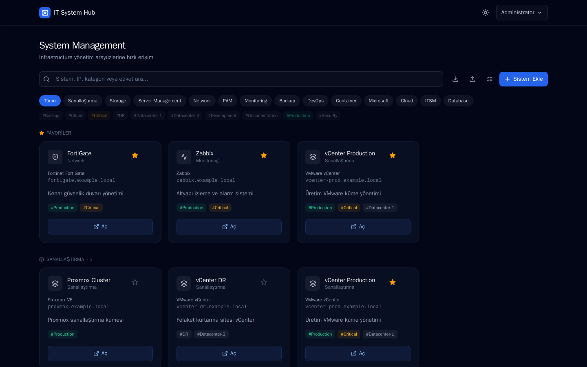
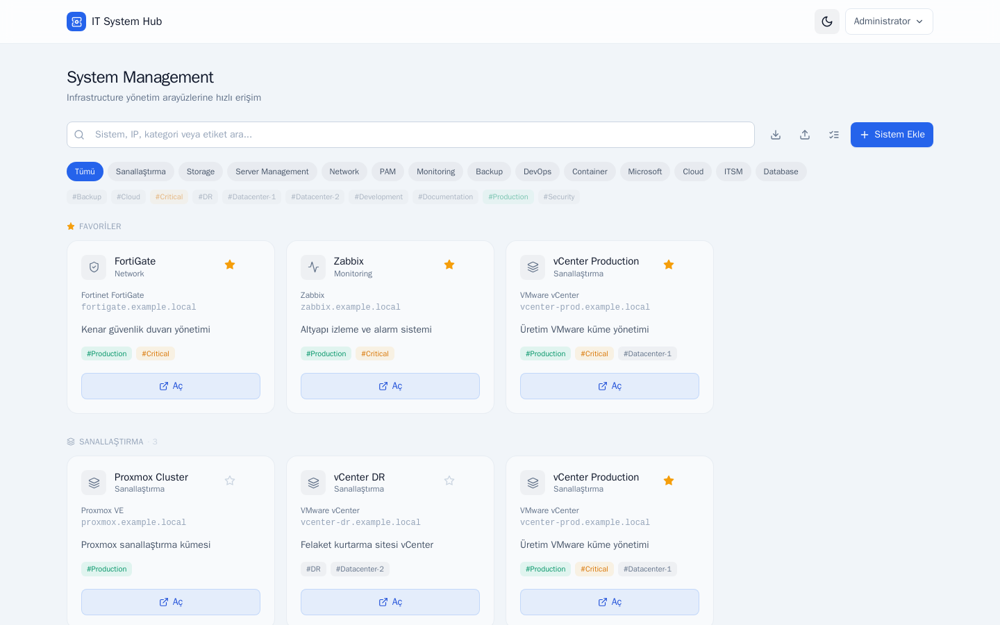
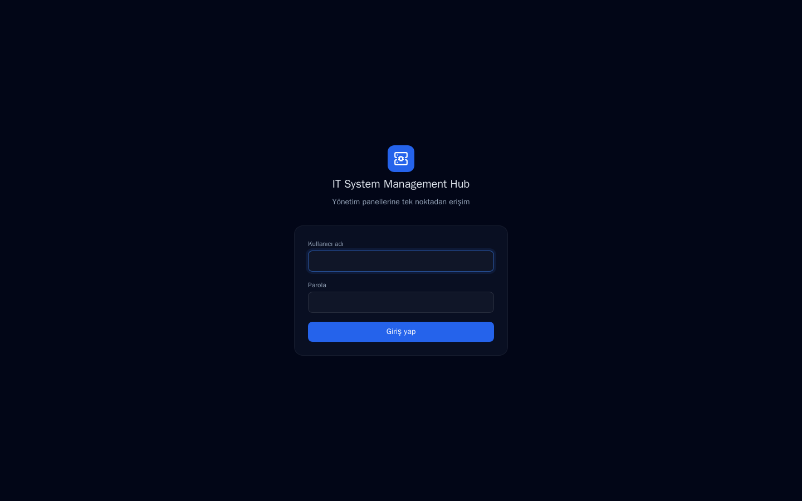
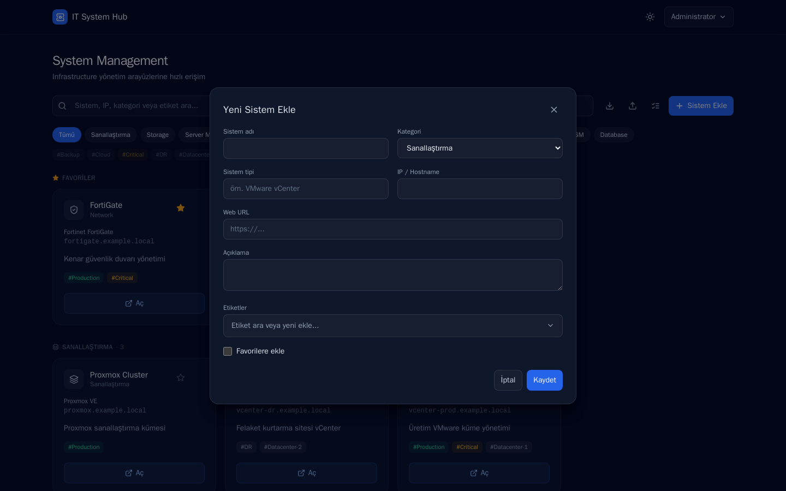
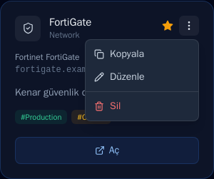

# IT System Management Hub

Sistem uzmanlarının kullandığı tüm yönetim panellerini (VMware, Proxmox, Storage, iLO/iDRAC,
Firewall, Monitoring, Backup, DevOps, PAM, vb.) tek bir ekrandan bulup açabildiği, sade ve hızlı bir
**infrastructure launchpad**.

Uygulama yönetilen sistemleri kendisi yönetmez; sadece adres/kategori/etiket gibi metadata'yı
saklar ve tek tıkla ilgili panele yönlendirir. Yönetilen sistemlerin kullanıcı adı/parolası hiçbir
zaman saklanmaz.

## Özellikler

- **Kategori bazlı dashboard** — sistemler kategoriye göre gruplanır, tek kategoriye de
  filtrelenebilir
- **Arama & etiket filtresi** — sistem adı, IP/hostname, kategori, tip ve etikete göre anlık arama
- **Favoriler** — sık kullanılan sistemler dashboard'un üstünde ayrı bir alanda; favoriler kişiseldir,
  her kullanıcı kendi listesini tutar
- **Rol bazlı erişim** — Admin (ekleme/düzenleme/silme, kategori/etiket/kullanıcı/grup yönetimi) ve
  User (görüntüleme, açma, favorileme)
- **Grup bazlı görünürlük** — kullanıcılar yalnızca üye oldukları grupların kategorilerini görür
  (bkz. [Erişim yönetimi](#erişim-yönetimi-gruplar))
- **Toplu içe/dışa aktarma** — sistemleri ve grupları JSON olarak dışa aktarma, toplu
  ekleme/güncelleme için içe aktarma
- **Kart klonlama** — benzer bir sistemi tek tıkla kopyalayıp küçük değişikliklerle kaydetme
- **Dark / Light tema** — varsayılan koyu tema, açık temaya geçiş desteklenir
- **Tamamen çevrimdışı çalışabilir** — build sonrası çalışma zamanında hiçbir internet bağlantısı
  gerekmez; intranet/air-gapped ortamlar için uygundur

## Ekran görüntüleri

| Dashboard (dark) | Dashboard (light) |
|---|---|
|  |  |

| Giriş ekranı | Sistem ekleme |
|---|---|
|  |  |



*(Ekran görüntülerindeki tüm sistemler örnek/demo verisidir.)*

## Hızlı başlangıç (Docker)

```bash
git clone <bu-repo> ithub && cd ithub
cp .env.example .env
# .env içindeki SESSION_SECRET, ADMIN_USERNAME, ADMIN_PASSWORD değerlerini güncelleyin
docker compose up -d --build
```

Uygulama `http://localhost:3300` adresinde açılır (port `docker-compose.yml` içinde
değiştirilebilir). İlk girişte `.env`'deki `ADMIN_USERNAME` / `ADMIN_PASSWORD` kullanılır
(varsayılan: `admin` / `ChangeMe123!`) — **ilk girişten sonra parolayı Kullanıcı Yönetimi
ekranından değiştirin.** Rol ayrımını görebilmeniz için ilk kurulumda bir de `demo` / `Demo123!`
kullanıcısı ("Herkes" grubunda) oluşturulur; istemiyorsanız Kullanıcı Yönetimi'nden silin. Silinen
demo hesabı container yeniden başlatıldığında geri gelmez.

Veriler `ithub-data` adlı Docker volume'ünde (SQLite) tutulur, container yeniden
başlatıldığında/güncellendiğinde korunur.

```bash
docker compose down       # container'ı durdurur, veriyi korur
docker compose down -v    # veriyi de siler
```

### Yerel geliştirme (Docker olmadan)

Node.js 20+ gerekir.

```bash
npm install
npx prisma migrate dev
npx tsx prisma/seed.ts
npm run dev
```

## Erişim yönetimi (gruplar)

Admin menüsündeki **Grup ve Erişim Yönetimi** ekranından (`/admin/groups`) kimin hangi kategorileri
göreceği belirlenir.

- **Admin** kullanıcılar gruplardan bağımsız olarak her şeyi görür.
- **Kullanıcı** rolündekiler, üye oldukları **tüm grupların kategorilerinin birleşimini** görür.
- Bir grupta **"Tüm kategoriler"** işaretliyse o grup her şeyi verir; sonradan eklenen kategoriler
  de otomatik dahildir. İşaretli değilse yalnızca seçilen kategoriler görünür. Bu durumda yeni
  eklenen bir kategori, bir gruba eklenene kadar bu kullanıcılara görünmez.
- Yasaklama kuralı yoktur. Bir kategoriyi birinden gizlemek, onu o kategoriyi veren bir gruba
  koymamak demektir.
- **Hiçbir grupta olmayan** (veya gruplarında kategori olmayan) kullanıcı hiçbir sistem görmez ve
  panelinde "Size henüz erişim tanımlanmadı" mesajı çıkar. Kullanıcı listesinde bu kişiler
  "Erişimi yok" uyarısıyla işaretlenir.
- Kullanıcıların grupları hem grup ekranından (üyeler) hem de kullanıcı formundan (gruplar)
  düzenlenebilir.

Filtre sunucu tarafında uygulanır: görünmeyen kategorilerin sistemleri, etiketleri ve sayıları
API'den de dönmez. Rol ve grup değişiklikleri kullanıcının bir sonraki isteğinde geçerli olur,
yeniden giriş gerekmez.

**1.1 → 1.2 yükseltmesi:** Migration, "Tüm kategoriler" yetkili bir **"Herkes"** grubu oluşturur ve
mevcut tüm kullanıcıları bu gruba ekler. Yani yükseltmeden sonra kimsenin gördüğü değişmez.
Kısıtlamak istediğiniz kullanıcıları "Herkes"ten çıkarıp daha dar gruplara ekleyin. Önceden ortak
olan favoriler de her kullanıcıya ayrı ayrı kopyalanır.

### Dışa/içe aktarma formatı

Dışa aktarma `{ "format": "ithub-export", "version": 2, "systems": [...], "groups": [...] }`
biçiminde bir dosya üretir. Gruplar kategorilere adıyla, üyelere kullanıcı adıyla bağlanır.
Parolalar dışa aktarılmaz. İçe aktarma bu formatı ve eski sürümlerin ürettiği düz sistem dizisini
kabul eder. Dosyadaki bir grup aynı isimli mevcut grubun kategori ve üye listesinin yerine geçer.
Bulunamayan kategori/kullanıcı adları atlanır ve sonuçta raporlanır. `isFavorite` alanı içe/dışa
aktarmayı yapan admin'in kendi favorilerini ifade eder.

## Yapılandırma

| Değişken | Açıklama | Varsayılan |
|---|---|---|
| `DATABASE_URL` | SQLite dosya yolu | `file:../data/ithub.db` |
| `SESSION_SECRET` | Oturum çerezi şifreleme anahtarı, en az 32 karakter | — (zorunlu) |
| `ADMIN_USERNAME` / `ADMIN_PASSWORD` / `ADMIN_NAME` | İlk seed'de oluşturulan admin hesabı | `admin` / `ChangeMe123!` / `Administrator` |
| `COOKIE_SECURE` | `true` yalnızca uygulama HTTPS arkasındaysa | `false` |

## Mimari

- **Next.js 14** (App Router, TypeScript) + **Prisma / SQLite** + **iron-session** (cookie tabanlı
  oturum, harici auth servisi yok)
- **Tailwind CSS** — koyu tema öncelikli, tek accent renk, minimal görsel gürültü
- Oturum çerezi yalnızca kimliği taşır. Kullanıcının rolü ve grupları her istekte veritabanından
  okunur (`src/lib/session.ts`). `/admin/*` sayfaları `src/app/admin/layout.tsx`, `/api/admin/*`
  uçları ise `guardApi("ADMIN")` ile sunucu tarafında korunur. Görünürlük kuralları
  `src/lib/access.ts`'te toplanmıştır.
- Auth katmanı izole (`src/lib/session.ts`) — ileride LDAP/AD, SSO veya PAM entegrasyonu bu katman
  üzerinden eklenebilecek şekilde tasarlandı

## Yol haritası

Henüz eklenmemiş, ileride planlanan: LDAP/Active Directory, SSO, sistem erişilebilirlik/sağlık
kontrolü, audit log, genel API, NetBox entegrasyonu, PAM entegrasyonu.
